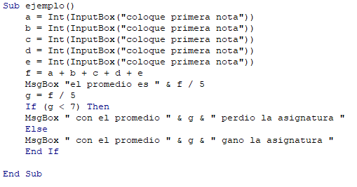

# Programacion

## Septiembre 13/2021 
  
En la clase de hoy nos colocamoos a sacra el promedio de 7 notas en donde se tenia que mostrar un mensaje si aprobaba o reprobaba.

## Ejemplo en la clase 

```
Sub ejemplo ()
    
    n = Int(InputBox("ingrese el primer 
    numero"))
    
    If (n > 10) Then
        MsgBox" n es mayor " & n & " o igual 
        que 10 "
    
    Else
        MsfBox" n es menor " & n & " que 
        10 "
    End If    
End Sub
```

## Desarrollo de la actividad 
