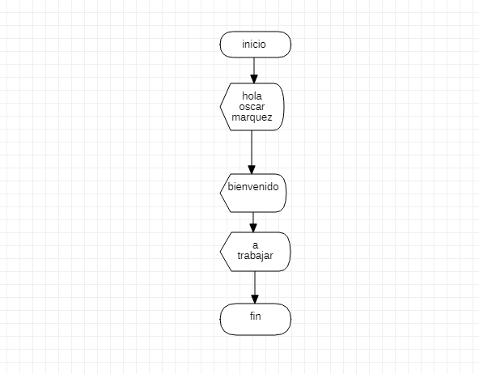

# Programacion 

## Septiembre 2 de 2021

 El instructor hablo sobre variables y se realizaron los siguientes ejercicios

## Ejemplo de la clase 
```
Sub ejemplo()

MsgBox "hola mundo"

End Sub
```

## Tarea
```
Sub ejemplo()
    MsgBox "Hola oscar marquez"
    MsgBox "Bienvenido"
    MsgBox "A trabajar"
End Sub
```
## Diagrama de flujo starUML

