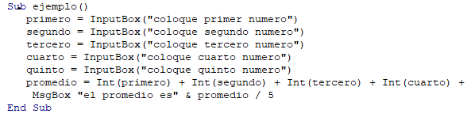

# Programacion 

## Septiembre/9/20201

En la clase de hoy comenzamos a trabajar con los programas starUML, Visual Basic aprendi que el comando "inputbox" tiene la funcionalidad de pedirle informacion al usuario.

## Ejemplo realizado en clase

```
Sub ejemplo () 
    a = InputBox("digite primer numero")
    b = InputBox("digite segundo numero")
    c = a + b 
    MsgBox "la suma es " & c
End Sub
```

## Desarrollo de lo aprendido


